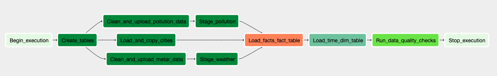

# Data Engineering Capstone Project: Pollution Analytics for India

## Project Overview
Air Pollution is a huge problem in India. This project sets up a facts and dimensions table for hypothetical users that want to use pollution analytics for improving public policy.

It seeks to answer questions like:
1. What are the most polluted cities and states?
2. When is air pollution the biggest problem in these areas?
3. Is there a link between weather and pollution levels?

## Step 1: Scope the Project and Gather Data

> Identify and gather the data you'll be using for your project (at least two sources and more than 1 million rows). See Project Resources for ideas of what data you can use.

3 data sources are used for this project:
1. A list of pollution levels by hour in various cities of India over the last 3 years. This data was scraped from the Central Pollution Control Board in India, and was made available by Loki.ai as a JSON file. This file is uploaded here at [pollution_data_final.json](pollution_data_final.json)
2. A list of weather attributes by hour in various cities of India over the last 3 years. This data was scraped from the Indian Airports METAR recordings, and was made available by Loki.ai as a JSON file. This file is uploaded here at [metar_data_final.json](metar_data_final.json)
3. A list of city attributes (state, latitude, and longitude). These were obtained using the Google Maps Geocoding API, and saved as a CSV file. This file is uploaded here at [cities.csv](cities.csv)

> Explain what end use cases you'd like to prepare the data for (e.g., analytics table, 
app back-end, source-of-truth database, etc.)
The end use case is a souce-of-truth database that can be used by public policy analysts to understand pollution trends better

## Step 2: Explore and Assess the Data
> Explore the data to identify data quality issues, like missing values, duplicate data, etc.

Using Pandas, several data quality issues were identified in an Exploratory Data Analysis phase. These included cities with duplicated spellings, values that were implausible (like negative PM2.5 readings) etc

> Document steps necessary to clean the data

City names with duplicated spellings were standardized, and values that were implausible were removed before putting the cleaned data to S3. This was documented in the file at [plugins/operators/clean_and_upload_data.py](plugins/operators/clean_and_upload_data.py)

## Step 3: Define the Data Model
> Map out the conceptual data model and explain why you chose that model

A star-schema was used for the data model. It consisted of one fact table which contained the pollution and weather attribute levels in a city at a given time, and two dimension tables – one for city attribitues and another for time attributes

The schema for these is shown below

### `facts` table
```
city varchar(256) NOT NULL, //the city name. since there were no cities with duplicate names, a `city_id` was not used
dt TIMESTAMP NOT NULL, //the timestamp for which the data was recorded
pm10 INTEGER, //PM10 concentration
pm25 INTEGER, //PM2.5 concentration
temp INTEGER, //temperature in degrees celsius
wind_speed INTEGER //wind speed in knots
```
An integer instead of float data type was chosen for `PM10`, `PM25`, `temp`, and `wind_speed` since all the data provided in the source was as an integer

### `cities` table
```
city varchar(256) NOT NULL, //the city name. can be used to join with `facts` table
state varchar(256) NOT NULL, //the state/province the city is a part of
latitude FLOAT, //the latitude of the city
longitude FLOAT //the longitude of the city
```

### `time` table
```
dt timestamp NOT NULL UNIQUE,  //the timestamp for which the data was recorded
hour int4, //the hour of this timestamp
day int4, //the day of month of this timestamp
week int4, //the week of year of this timestamp
month int4, //the month of this timestamp
year int4, //the year of this timestamp
weekday int4, //the day of week of this timestamp
CONSTRAINT time_pkey PRIMARY KEY (dt)
```

This model was chosen as it is simple and intuitive to understand for business users, and represents the underlying data well.

> List the steps necessary to pipeline the data into the chosen data model

Airflow is used to pipeline the data into the model. A visual summary of the pipeline is below:


1. First, the necessary tables are created in RedShift
2. Then, nested JSON data is cleaned and saved as a CSV on S3
3. Afterwards, Staging Tables are created on Redshift from S3
4. Next, facts and dimension tables are created on Redshift
5. Lastly, data quality checks are run to ensure that data has been correctly loaded

## Step 4: Run ETL to Model the Data
> Create the data pipelines and the data model

This is done using Airflow


> Include a data dictionary

This was included above, and is replicated here again

### `facts` table
```
city varchar(256) NOT NULL, //the city name. since there were no cities with duplicate names, a `city_id` was not used
dt TIMESTAMP NOT NULL, //the timestamp for which the data was recorded
pm10 INTEGER, //PM10 concentration
pm25 INTEGER, //PM2.5 concentration
temp INTEGER, //temperature in degrees celsius
wind_speed INTEGER //wind speed in knots
```
An integer instead of float data type was chosen for `PM10`, `PM25`, `temp`, and `wind_speed` since all the data provided in the source was as an integer

### `cities` table
```
city varchar(256) NOT NULL, //the city name. can be used to join with `facts` table
state varchar(256) NOT NULL, //the state/province the city is a part of
latitude FLOAT, //the latitude of the city
longitude FLOAT //the longitude of the city
```

### `time` table
```
dt TIMESTAMP NOT NULL UNIQUE,  //the timestamp for which the data was recorded
hour INTEGER, //the hour of this timestamp
day INTEGER, //the day of month of this timestamp
week INTEGER, //the week of year of this timestamp
month INTEGER, //the month of this timestamp
year INTEGER, //the year of this timestamp
weekday INTEGER, //the day of week of this timestamp
CONSTRAINT time_pkey PRIMARY KEY (dt)
```

> Run data quality checks to ensure the pipeline ran as expected

There are integrity constraints on data types in the relational database to ensure that the wrong type of data is not added to it

Additionally, count checks are done at the end of the data pipeline to ensure that data has loaded correctly

## Step 5: Complete Project Write Up
> What's the goal? What queries will you want to run? How would Spark or Airflow be incorporated? Why did you choose the model you chose?

As highlighted in the `Project Overview` section,

Air Pollution is a huge problem in India. This project sets up a facts and dimensions table for hypothetical users that want to use pollution analytics for improving public policy.

It seeks to answer questions like:
1. What are the most polluted cities and states?
2. When is air pollution the biggest problem in these areas?
3. Is there a link between weather and pollution levels?

Sample queries that are run on this data are in the [eda.ipynb notebook](eda.ipynb)

> Clearly state the rationale for the choice of tools and technologies for the project.

The following tools were used in this project:

**Airflow for Data Pipeline Orchestration**: Airflow was used to ensure that the tasks for this project run in the order intended, and so that we have visibility if any of these tasks fails

**Redshift for Data Warehousing**: Redshift was used for data warehousing to ensure rapid analysis of problems, as well as scalability if more compute is needed

**Single-node python for Data Cleaning**: Python on a single machine was used for data cleaning and pre-processing. Since the data size was relatively small (roughly 200MB), it would have been overkill to work on a distributed system for data cleaning

> Document the steps of the process.

1. Acquiring data from government sites via web-scraping
2. Cleaning the data to ensure that garbage values are not sent to the data warehouse
3. Converting nested JSON into a CSV for easier consumption by Redshift
4. Creating staging tables on Redshift
5. Creating fact and dimensions tables on Redshift
6. Doing data quality checks to ensure that everything is working fine
7. Doing some exploratory 

> Propose how often the data should be updated and why.

The data should be updated once a month, as it is meant for analysis of historical data instead of real-time applications

### Include a description of how you would approach the problem differently under the following scenarios:

> If the data was increased by 100x.

Spark would be used for data pre-processing instead of a single-node machine

> If the pipelines were run on a daily basis by 7am.

A cron schedule will be added to the Airflow DAG (`schedule_interval="0 7 * * *",`)

> If the database needed to be accessed by 100+ people.

We would pre-compute common queries using the `cube` function and save the results in S3 to prevent the high load that multiple concurrent users can bring